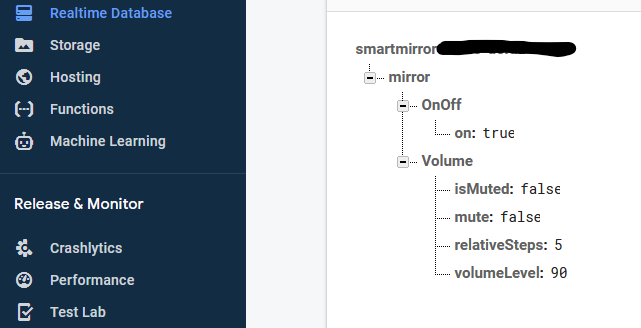

# Firebase-Smarthome 

This can be placed on any device. This is the deployment for Firebase Functions.

Codelab: [Smarthome-Washer](https://kiosk-dot-codelabs-site.appspot.com/codelabs/smarthome-washer/index.html?index=..%2F..index#1) for getting started with example + walkthrough. 

This is a Firebase Function and device attributes that will upload to a Realtime Database.

## Setup Firebase on Raspiberry Pi 
**Install:**
``` sh
$ npm install -g firebase-tools 
```

**Setup and Login:**
``` sh
$ firebase --version
$ firebase login 
$ firebase use --add {PROJECT NAME}
$ npm --prefix functions/ install 
```

**Credentials:**
Append the following to your *~/.bashrc*
``` python
# <<< FIREBASE >>>
export FIREBASE_TOKEN="COPY AND PASTE TOKEN"
# <<< Magic Mirror Pub/Sub <<<
export GOOGLE_APPLICATION_CREDENTIALS="/path/to/service/key.json"
```
Note: Firebase token is used for authentication when using the firebase-tools command line interface \
Google App Creds are used for Magic Mirror Pub Sub API, and not required for Firebase.  

**Initalize Firebase Application**

 

Select: Realtime Datase, Functions, Hosting, and follow prompt. I highly recommend the CodeLabs before attempting to setup this repository. 

**Result in Realtime Database**
A successful deployment + setup of a Realtime Database on your Google Project will result in 

**Result:**
Successful deployment will create a testing interface at https:<project_id>.web.app/

